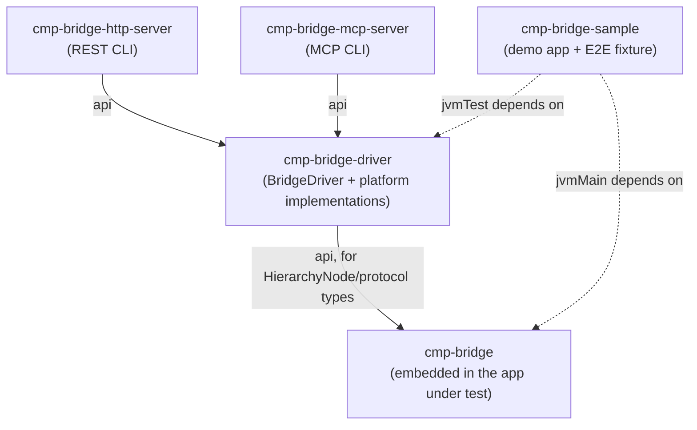

# Architecture

cmp-bridge drives a running Compose Multiplatform app for automation and end-to-end
testing — read its live UI tree, click/type/scroll into it, capture screenshots — the
same role Espresso, XCUITest, or Playwright play for their platforms, but for Compose
Multiplatform apps (currently desktop/JVM and wasmJs web).

It is split into a library that ships inside an app and a set of standalone tools that
drive an app from outside it. Everything is built around one shared vocabulary: a
platform-independent tree of `HierarchyNode`s and five operations (`getHierarchy`,
`click`, `setText`, `scroll`, `screenshot`) defined once by the `BridgeDriver`
interface.

## Module map

| Module | Kind | Depends on | Role |
|---|---|---|---|
| `cmp-bridge` | KMP library (android, jvm, wasmJs); bridge server is jvm-only | — | Ships inside the app under test. Defines the wire protocol and `HierarchyNode`, and on desktop runs the in-process bridge server. |
| `cmp-bridge-driver` | JVM library | `cmp-bridge` | Consumed by an app's own test code. `BridgeDriver` interface plus its desktop and web implementations, plus helpers to launch/tear down the app or dev server under test. |
| `cmp-bridge-http-server` | JVM application | `cmp-bridge-driver` | Standalone process exposing a `BridgeDriver` over a local REST API, for non-JVM tooling. |
| `cmp-bridge-mcp-server` | JVM application | `cmp-bridge-driver` | Standalone process exposing a `BridgeDriver` over MCP (stdio), for LLM agents. |
| `cmp-bridge-sample` | KMP application (jvm, wasmJs) | `cmp-bridge`, `cmp-bridge-driver` (test-only) | Minimal demo screen used as the real end-to-end fixture: the same UI is driven on both platforms in `DemoScenarioTest`. |

## The shared protocol: `HierarchyNode`, `BridgeCommand`/`BridgeResponse`

`cmp-bridge` (`HierarchyNode.kt`, `BridgeProtocol.kt`) defines the types every other
module builds on:

- **`HierarchyNode`** — one node in the app's live semantics/accessibility tree:
  `testTag`, normalized `role`, `text`, `contentDescription`, bounds (`x`/`y`/`width`/
  `height`), `enabled`, the set of supported `actions`, and `children`. `role` is
  normalized to the same vocabulary web accessibility trees use (`"button"`,
  `"checkbox"`, `"textbox"`, `"list"`, `"grid"`, ...), so desktop and web produce
  interchangeable trees despite reading from different underlying systems. `flatten()`
  and `find(tag)` (extension functions) give every driver the same tag lookup for free.
- **`BridgeCommand`/`BridgeResponse`** — the wire protocol between the in-app desktop
  bridge server and `DesktopBridgeDriver`: one JSON-encoded command per line in, one
  JSON-encoded response per line out, over a plain TCP socket. Not used by the web path
  at all (see below).

## Getting into a running app: two different mechanisms per platform

The two platforms expose their live UI completely differently, and cmp-bridge does not
try to paper over that at the transport level — it only unifies the *result*
(`HierarchyNode`) and the *driver API* (`BridgeDriver`).

### Desktop (JVM): an in-app socket server

`DesktopBridgeServer` (in `cmp-bridge`, jvmMain-only) is object code linked into the
app itself. `startIfEnabled(window, scope)` is a no-op unless the app was launched with
`CMP_BRIDGE_ENABLED=true` or `-DcmpBridge.enabled=true` — it must be opt-in, since the
mechanisms it uses would be a liability in a shipped build. Both an env var and a system
property are supported deliberately: a `-D` flag isn't inherited by a forked child
process on any launcher (Gradle's `JavaExec`, an IDE run configuration, ...) unless that
launcher explicitly forwards it, while an env var is, by default, virtually everywhere —
so the env var is what actually works out of the box through something like
`./gradlew :app:run` for any app embedding this library, with no Gradle changes needed
on that app's end. The system property stays supported for callers that construct the
process directly (`DesktopAppProcess`) or invoke `java` themselves.

- **Reads** come from `ComposeWindow.semanticsOwners` — the real semantics tree,
  queried fresh on every request, never cached.
- **Writes** (click, type, scroll) are synthesized as real AWT `MouseEvent`/
  `MouseWheelEvent`/`KeyEvent`s posted onto the app's own `EventQueue`, targeting
  whichever component in the window actually has mouse listeners registered (found by
  walking the AWT component tree, not hardcoded — that internal nesting is
  version-dependent). This deliberately avoids `java.awt.Robot`, which drives the OS
  input queue rather than the app, and would fail in headless/CI environments.
  Multi-character text entry goes through the system clipboard + Ctrl+V rather than
  simulated keystrokes, since per-character key simulation doesn't reliably handle
  unicode/locale-specific input.
- **Screenshots** are taken via `SkiaLayer.screenshot()` — Compose Desktop renders through Skia
  directly, bypassing the standard AWT/Swing paint chain entirely, so `Component.paint()` into an
  off-screen image only ever captures a blank background. `Robot.createScreenCapture` was also
  rejected: it reads real screen pixels, which needs an actual mapped, unoccluded window and X11
  permission to capture it — fragile in exactly the kind of sandboxed/CI environment this bridge
  needs to work in.

`DesktopBridgeServer` accepts one connection per client and speaks the
`BridgeCommand`/`BridgeResponse` line protocol described above. `DesktopBridgeDriver`
(in `cmp-bridge-driver`) is the client side: `connect(host, port)` waits for the socket
to become connectable, then opens a fresh `Socket` per command (it owns no persistent
connection or process — see "Connecting vs. launching" below).

### Web (wasmJs): Compose Multiplatform's built-in accessibility DOM

There is no equivalent in-app server for web, and no wasmJs code in `cmp-bridge` at
all. Compose Multiplatform's web target already renders a hidden accessibility DOM
(`#cmp_a11y_root`, inside a shadow root) for screen readers, and `WebBridgeDriver` (in
`cmp-bridge-driver`) reads and drives that directly:

- **Reads**: a Playwright `page.evaluate()` call runs a small JS tree-walker
  (`WALK_ACCESSIBILITY_TREE_JS`) over `#cmp_a11y_root`, shaping each DOM element into
  the same `HierarchyNode` JSON shape the desktop bridge produces.
- **Writes**: real Playwright `page.mouse()`/`page.keyboard()` calls — genuine browser
  input, not DOM event dispatch.
- **Screenshots**: `page.screenshot()`.

Because this path rides on the browser's accessibility tree rather than Compose's
internal semantics tree, its `HierarchyNode`s are a strictly smaller, best-effort
subset of desktop's: `enabled` is always `true`, `actions` can only infer `"OnClick"`
from ARIA role, and a couple of known gaps are called out where they bite (see
"Known platform gaps" below).

### `BridgeDriver`: the common interface

`BridgeDriver` (`cmp-bridge-driver/BridgeDriver.kt`) is the seam everything above the
transport layer is written against: `getHierarchy`, `getBounds`/`waitForTag` (default
methods built on `getHierarchy`), `click`, `setText`, `scroll`, `screenshot`, and
`close` (`AutoCloseable`). `DesktopBridgeDriver` and `WebBridgeDriver` are its only two
implementations. Everything downstream — the HTTP server, the MCP server, an app's own
test code — is written against this interface, not against either platform's transport.

### Connecting vs. launching

`cmp-bridge-driver` deliberately separates *attaching to an already-running app* from
*launching one*:

- `DesktopBridgeDriver.connect` / `WebBridgeDriver.connect` only ever attach — `close()`
  never touches a process.
- `DesktopAppProcess.launch(mainClass)` and `WasmDevServerProcess.launch(gradleModulePath)`
  own a subprocess (the app itself, or the wasmJs webpack dev server) — launching with
  an isolated `user.home`, polling until its port is connectable, and tearing it down on
  `close()`.
- `ManagedBridgeDriver(resource, driver)` composes the two by delegation (`BridgeDriver
  by driver`) so a caller that launched its own app gets single-call teardown (driver
  first, then the process) instead of managing both lifecycles by hand.

This split exists because the http/mcp servers only ever attach to an app someone else
already started (see below), while `cmp-bridge-sample`'s own tests need to launch a
disposable instance per test run — the same `BridgeDriver` implementations serve both.

## Standalone servers: exposing a `BridgeDriver` to the outside world

`cmp-bridge-http-server` and `cmp-bridge-mcp-server` are structurally identical: a
Clikt CLI takes `--platform desktop|web` plus connection args (`--host`/`--port` for
desktop, `--url` for web — see `BridgeExplorerOptions`, intentionally duplicated in
both modules rather than shared through a third one), connects a `BridgeDriver`, and
adapts its five operations to a different transport. Neither ever launches an app —
both assume one is already running with the bridge armed (or a wasmJs dev server is
already up).

- **`cmp-bridge-http-server`**: Ktor + Netty, a single `POST /bridge` endpoint. The
  request body is an envelope, `{"operation": "...", "payload": {...}}`, dispatched in
  `Routes.kt` on `operation` to the matching `BridgeDriver` call with `payload` decoded
  into that operation's own argument type. `Routes.kt` is a thin adapter only; every
  branch calls straight into the driver, and `BridgeDriver` failures — including an
  unrecognized `operation` — are surfaced as `400` with the exception's message via a
  `StatusPages` handler, not a generic `500`.
- **`cmp-bridge-mcp-server`**: MCP over stdio (`kotlin-sdk`), one tool per driver
  operation (`get_hierarchy`, `click`, `set_text`, `scroll`, `screenshot`), registered in
  `Tools.kt`. Because the MCP JSON-RPC stream *is* stdout, `main` captures the real
  `System.out` before anything else runs and redirects `System.out` to stderr for the
  rest of the process — any stray print from a dependency lands somewhere harmless
  instead of corrupting the wire protocol. Driver failures are caught per-tool-call
  (`safeCall`) and turned into an MCP tool-level error rather than crashing the session.

## `cmp-bridge-sample`: the real fixture

`cmp-bridge-sample` is a minimal Compose app (a counter, a text field, a scrollable
list) whose composable (`App.kt`) is shared verbatim between the jvm and wasmJs entry
points, each element carrying a stable `testTag`. `DemoScenarioTest` drives that exact
UI through `BridgeDriver` on both platforms in the same test class — desktop via
`DesktopAppProcess` + `DesktopBridgeDriver`, web via `WasmDevServerProcess` +
`WebBridgeDriver` — which makes it the project's end-to-end proof that the whole stack
(in-app server or accessibility DOM → driver → real input/read) actually works, not
just that the pieces compile. It's also the best reference for how a consuming app
wires the bridge in (`Main.kt` on both platforms) and drives it from a test.

## Known platform gaps

The web path's `HierarchyNode`s are a best-effort subset of desktop's, and a couple of
gaps are tracked rather than silently swallowed:

- `WebBridgeDriver.scroll` is unreliable in some sandboxed headless Chromium builds
  (tracked as a known issue in the driver's own doc comment).
- Password fields aren't masked in the web accessibility walk the way
  `DesktopBridgeServer` masks them (also tracked there).
- A `BasicTextField`'s bounds can permanently read as zero in the web accessibility DOM
  even though its live text is still correct — `DemoScenarioTest`'s web case documents
  exactly which of the five operations it does and doesn't exercise as a result.

Callers driving both platforms with the same test code should treat these as platform
capability differences to poll/branch around, not as bugs in the caller's own test.

## Design invariants worth preserving

- **Debug/test only, always opt-in.** `DesktopBridgeServer` never starts unless
  `CMP_BRIDGE_ENABLED=true` or `-DcmpBridge.enabled=true` is set explicitly; there is no
  way for it to activate in a normal run of a consuming app.
- **Real tree, real input, never a platform input-injection API.** Reads always come
  from the platform's own live semantics/accessibility tree (never cached, never
  reconstructed from a snapshot); writes always go through real input events on the
  app's own event queue/browser input, never `java.awt.Robot` or raw DOM event
  dispatch. This is what makes the bridge exercise the same code paths a real user
  would, rather than bypassing them.
- **`BridgeDriver` is the only shared surface above the transport.** Desktop and web
  stay free to diverge in how they read/write (socket protocol vs. Playwright) as long
  as both produce `HierarchyNode` and implement the same five operations. Don't
  smuggle platform-specific concepts up through the interface.
- **Connect and launch are separate concerns.** `*BridgeDriver.connect` never owns a
  process; `*Process.launch` never speaks the bridge protocol. `ManagedBridgeDriver` is
  the only place the two are composed. New driver/process pairs should keep that split.
