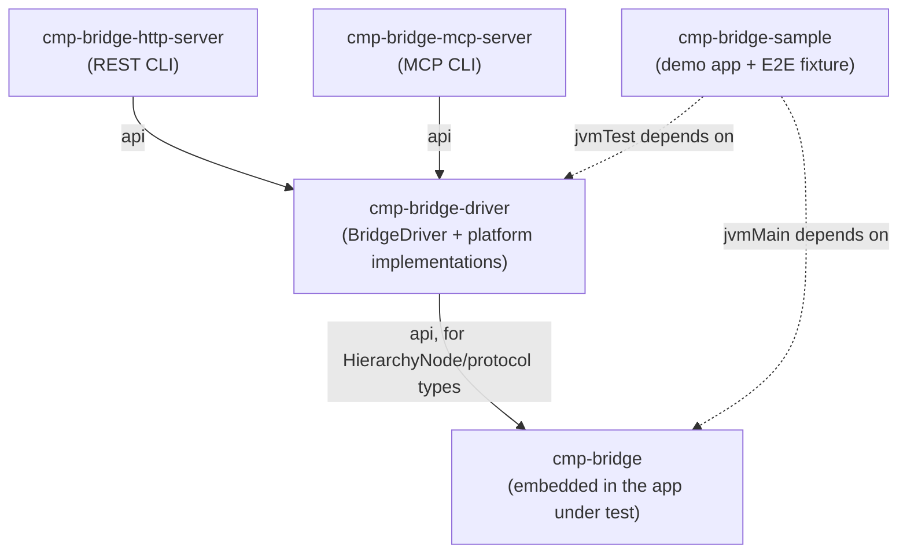

# cmp-bridge

> [!IMPORTANT]  
> This library is used by me internally and it is expected to be used and maintained for the foreseeable future.
> Consider it at an **alpha** state with breaking changes on any release. Once we reach a stable 1.0 release, we will
> begin following semantic versioning.

Drive a running [Compose Multiplatform](https://www.jetbrains.com/lp/compose-multiplatform/)
app for UI automation and end-to-end testing: read its live semantics tree, click,
type, scroll, and capture screenshots — through the app's *real* input pipeline, not a
simulated one. Think Espresso, XCUITest, or Playwright, but for Compose Multiplatform,
currently across desktop (JVM) and web (wasmJs).

It ships as a small library you embed in your app plus a driver and two standalone
servers (REST and MCP) for driving that app from outside — from a JVM test, a
non-JVM test runner, or an LLM agent.

For how the pieces fit together, see [ARCHITECTURE.md](ARCHITECTURE.md). To contribute,
see [CONTRIBUTING.md](CONTRIBUTING.md).

## How it works, briefly

- **Desktop**: your app opts in to an in-process debug socket server
  (`DesktopBridgeServer`) that reads Compose's real `semanticsOwners` tree and drives
  the app with real AWT input events posted onto its own event queue — never
  `java.awt.Robot`. Off unless explicitly armed.
- **Web**: no code needed in your app at all. Compose Multiplatform's web target
  already renders a hidden accessibility DOM for screen readers, and cmp-bridge drives
  that directly through a real headless browser (Playwright). Playwright needs its own
  host OS shared libraries installed on top of the Chromium binary it downloads — see
  [CONTRIBUTING.md's Prerequisites](CONTRIBUTING.md#prerequisites) if `WebBridgeDriver`
  fails to launch it.

Both platforms are exposed through the same interface, `BridgeDriver` — a core set of
operations (`getHierarchy`, `click`, `setText`, `scroll`, `screenshot`) and one shared
tree shape, `HierarchyNode`. See [ARCHITECTURE.md](ARCHITECTURE.md) for the full
breakdown, including where the two platforms' capabilities differ.

The blue boxes below are cmp-bridge's own modules; everything else — your app, your
test code, curl, an LLM agent — is external to this project and just talks to them:



## Modules

| Module | What it's for |
|---|---|
| `cmp-bridge` | Add to your app. Defines the wire protocol and runs the in-process bridge server on desktop. |
| `cmp-bridge-driver` | Add to your test source set. `BridgeDriver` plus its desktop/web implementations and helpers to launch a disposable app/dev-server instance. |
| `cmp-bridge-http-server` | Standalone process. Exposes a running app's bridge over a local REST API. |
| `cmp-bridge-mcp-server` | Standalone process. Exposes a running app's bridge over MCP (stdio), for LLM agents. |
| `cmp-bridge-sample` | A minimal demo app plus an end-to-end test (`DemoScenarioTest`) driving it on both platforms — the best reference for wiring the bridge into your own app. |

## Installing

Published to Maven Central under the `com.cramsan.cmpbridge` group (see
[RELEASING.md](RELEASING.md) if you're looking for how releases are cut). Note that
the coordinates below only resolve once a release has actually been published — until
then, consume this repo as a Gradle composite build
(`includeBuild("path/to/cmp-bridge")` in `settings.gradle.kts`) or a git submodule
instead.

```kotlin
dependencies {
    // Embed in your app (desktop-only bridge server; the wasmJs target needs no
    // extra dependency at all — see "How it works, briefly" above).
    implementation("com.cramsan.cmpbridge:cmp-bridge:0.1.0.3")

    // Add to your test source set to drive an app directly.
    testImplementation("com.cramsan.cmpbridge:cmp-bridge-driver:0.1.0.3")
}
```

`cmp-bridge-http-server` and `cmp-bridge-mcp-server` aren't published to Maven Central —
they're CLI applications, not libraries, so there's no `implementation(...)` line for
them. Run them as standalone processes instead (see "Trying it out with the sample app"
and "Driving an app over HTTP or MCP" below): either from a
[GitHub Release](https://github.com/CRamsan/cmp-bridge/releases) (download
`cmp-bridge-http-server-all.jar` / `cmp-bridge-mcp-server-all.jar` and
`java -jar` it directly — no Gradle or JDK toolchain setup needed beyond a JRE), or
from source via `./gradlew :module:run`.

## Using it in your own app

**1. Embed the bridge (desktop only — web needs nothing).**

```kotlin
// desktop entry point
fun main() = application {
    Window(onCloseRequest = ::exitApplication) {
        val scope = rememberCoroutineScope()
        DesktopBridgeServer.startIfEnabled(window, scope)
        App()
    }
}
```

`startIfEnabled` is a no-op unless the process is launched with `CMP_BRIDGE_ENABLED=true`
(or `-DcmpBridge.enabled=true`). Currently, the pattern we are using is to leave this capability in a normal build. 
But in the future we will be looking for a way to make it opt-in at build time, so that the bridge code is not
included in production builds. 

**2. Tag the elements you want to drive or read**, the same way you would for any
accessibility-based test tool:

```kotlin
Button(onClick = { ... }, modifier = Modifier.testTag("submit_button")) { ... }
```

> **Expect an up-front instrumentation pass on an untagged app.** There's no
> coordinate/text-based fallback (see [ARCHITECTURE.md](ARCHITECTURE.md) for why), so
> every element you need to drive needs a `testTag` first. One real-world app needed
> ~25 tags for a single complex form — budget per-screen instrumentation time before
> your first test, not tags added one-by-one as tests fail to find things.

**Driving a dropdown/select**: tag the field, then tag each option
`"${fieldTag}_option_$index"` — see `cmp-bridge-sample`'s `App.kt`/`DemoScenarioTest`
(`favorite_fruit_field`) for a complete example.

**3. Drive it from a test**, via `cmp-bridge-driver`:

```kotlin
val process = DesktopAppProcess.launch("com.example.myapp.desktop.MainKt")
val driver = DesktopBridgeDriver.connect(process.host, process.port)
ManagedBridgeDriver(process, driver).use { d ->
    d.click("submit_button")
    d.waitForText("status_text", TextComparator.Equals("Done"))
}
```

`WasmDevServerProcess` + `WebBridgeDriver.connect(url)` is the equivalent pair for a
wasmJs app. `WasmDevServerProcess.launch` takes a plain `command`/`workingDir` — it has
no built-in notion of Gradle or a repo root, so it's on the caller to build that command
(`cmp-bridge-sample`'s `DemoScenarioTest` is a complete, working example of both, including
that part).

**Timeouts**: `waitForTagVisibility`/`waitForText` default to a `timeoutMs` of `15_000`
(`BridgeDriver.DEFAULT_TIMEOUT_MS`), polling every `200`ms (`BridgeDriver.DEFAULT_POLL_INTERVAL_MS`)
in between. Both are per-call overridable (`d.waitForText(tag, comparator, timeoutMs = 30_000)`)
and also settable once for the whole driver instance, via `connect(...)`'s own
`defaultTimeoutMs`/`pollIntervalMs` parameters — useful for a slow CI environment or an app
whose navigations are consistently network-backed, so you don't have to repeat `timeoutMs =`
on every call:

```kotlin
val driver = DesktopBridgeDriver.connect(process.host, process.port, defaultTimeoutMs = 30_000)
```

## Trying it out with the sample app

The fastest way to see the bridge working is `cmp-bridge-sample`, without writing any
code:

**Desktop**

```bash
CMP_BRIDGE_ENABLED=true ./gradlew :cmp-bridge-sample:run
```

This opens the sample app with the bridge listening on `127.0.0.1:8901`. In another
terminal, start the HTTP server — it doesn't take a target at launch, only requests do:

```bash
./gradlew :cmp-bridge-http-server:run
```

In another terminal send a command to the server:
```bash
curl -X POST http://127.0.0.1:8090/bridge -H 'Content-Type: application/json' \
  -d '{"target":{"platform":"desktop"},"operation":"getHierarchy"}'
```

**Web**

```bash
./gradlew :cmp-bridge-sample:wasmJsBrowserDevelopmentRun
```

Then, once the dev server is up (using the same `cmp-bridge-http-server:run` command as
above — the server's launch doesn't depend on platform):

```bash
curl -X POST http://127.0.0.1:8090/bridge -H 'Content-Type: application/json' \
  -d '{"target":{"platform":"web","url":"http://127.0.0.1:8080/"},"operation":"getHierarchy"}'
```

There's no `curl`-equivalent quick check for the MCP path — MCP needs a real client
speaking the protocol, not a one-off request, so `./gradlew :cmp-bridge-mcp-server:run`
on its own won't show you anything happening. To try that path instead, build the fat
jar (`./gradlew :cmp-bridge-mcp-server:shadowJar`) and point an MCP client at it — see
"Driving an app over HTTP or MCP" below for the client config and full tool list.

## Driving an app over HTTP or MCP

Both standalone servers wrap the same `BridgeDriver` core operations, plus the
`waitForTagVisibility`/`waitForText` convenience helpers, and both work the same way: **one
long-running server instance resolves its target app instance per request/tool
call**, so it can drive any number of apps (or the same app across restarts) over its
lifetime. Every request/call carries a `target` — `{"platform": "desktop"}` (optionally
with `host`/`port`, defaulting to `127.0.0.1:8901`) or `{"platform": "web", "url":
"..."}`.

Resolving a target connects and caches a driver for it: cheap for desktop, but a web
target launches a real headless browser via Playwright. That cached session closes
automatically once it's been idle for `--max-idle-ms` (default 5 minutes) or alive for
`--max-session-ms` (default 30 minutes), whichever comes first, or immediately via the
`disconnect` operation/tool. Neither server launches the app itself — only attaches to
one that's already running.

Every driver connected this way also picks up the server's configured
`--default-timeout-ms` (default `15000`, matching `BridgeDriver.DEFAULT_TIMEOUT_MS`) and
`--poll-interval-ms` (default `200`) for `waitForTagVisibility`/`waitForText` calls that
don't pass their own `timeoutMs` — process-wide flags, not per-target, since they're set
once at server launch rather than per request/tool call.

**HTTP (`cmp-bridge-http-server`)**

1. **Have an app running with the bridge armed.** Either `cmp-bridge-sample` —
   `CMP_BRIDGE_ENABLED=true ./gradlew :cmp-bridge-sample:run` for desktop (bridge listens
   on `127.0.0.1:8901`), or `./gradlew :cmp-bridge-sample:wasmJsBrowserDevelopmentRun`
   for web — or your own app wired the same way (see "Using it in your own app" above).
2. **Build the fat jar** (once): `./gradlew :cmp-bridge-http-server:shadowJar` produces
   `cmp-bridge-http-server/build/libs/cmp-bridge-http-server-all.jar` — or grab it from a
   [GitHub Release](https://github.com/CRamsan/cmp-bridge/releases) instead of building.
3. **Start it** — no target flags; it's ready to attach to any app a request names:
   ```bash
   java -jar cmp-bridge-http-server-all.jar
   ```
   Run with `--help` for the full option list (`--server-port`, default `8090`, plus
   `--max-idle-ms`/`--max-session-ms`/`--default-timeout-ms`/`--poll-interval-ms`,
   described above).
4. **Send it requests.** It exposes every operation behind a single endpoint,
   `POST /bridge`. The request body is an envelope — `{"target": {...}, "operation":
   "...", "payload": {...}}` — where `target` picks the app instance, `operation` picks
   the driver call, and `payload` is that operation's own arguments (omitted for the
   ones that take none):

| `operation` | `payload` | Description |
|---|---|---|
| `getHierarchy` | — | Returns the app's current `HierarchyNode` tree as JSON. |
| `click` | `{"tag": "..."}` | Real synthetic click on the element with that test tag. |
| `setText` | `{"tag": "...", "text": "..."}` | Clicks the element, selects any existing content, and replaces it with `text` (`""` clears it). |
| `scroll` | `{"anchorTag": "...", "deltaY": N}` | Scroll gesture centered on `anchorTag`'s bounds. |
| `screenshot` | — | The app's current frame as a PNG (binary response). |
| `waitForTagVisibility` | `{"tag": "...", "visibility": "VISIBLE"|"GONE", "timeoutMs": N}` | Polls until `tag`'s existence matches `visibility`, up to `timeoutMs` (optional — defaults to the server's configured `--default-timeout-ms`); errors on timeout. `VISIBLE` is for a new tag appearing; `GONE` is for "same screen, state changed" cases like a success banner or dialog closing. Returns the node for `VISIBLE`, no body for `GONE`. |
| `waitForText` | `{"tag": "...", "comparator": {...}, "timeoutMs": N}` | Polls until `tag`'s settled text satisfies `comparator`, up to `timeoutMs` (optional — defaults to the server's configured `--default-timeout-ms`); errors on timeout. For "same screen, state changed" assertions — inline validation errors, toggled badges — that a click's own async state update may not have applied yet, not just a new tag appearing. |
| `disconnect` | — | Ends this target's session early, closing its driver. A no-op if it has none. |

`waitForText`'s `comparator` is one of four shapes, matched against the tag's settled (non-null) text:

| `comparator` | Matches when the text... |
|---|---|
| `{"type": "present"}` | ...is any non-null value. |
| `{"type": "empty"}` | ...is exactly `""`. |
| `{"type": "equals", "value": "..."}` | ...equals `value` exactly. |
| `{"type": "startsWith", "prefix": "..."}` | ...starts with `prefix`. |

```bash
curl -X POST http://127.0.0.1:8090/bridge -H 'Content-Type: application/json' \
  -d '{"target":{"platform":"desktop"},"operation":"getHierarchy"}'
curl -X POST http://127.0.0.1:8090/bridge -H 'Content-Type: application/json' \
  -d '{"target":{"platform":"desktop"},"operation":"click","payload":{"tag":"increment_button"}}'
curl -X POST http://127.0.0.1:8090/bridge -H 'Content-Type: application/json' \
  -d '{"target":{"platform":"desktop"},"operation":"setText","payload":{"tag":"name_field","text":"Ada"}}'
curl -X POST http://127.0.0.1:8090/bridge -H 'Content-Type: application/json' \
  -d '{"target":{"platform":"desktop"},"operation":"scroll","payload":{"anchorTag":"item_list","deltaY":5}}'
curl -X POST http://127.0.0.1:8090/bridge -H 'Content-Type: application/json' \
  -d '{"target":{"platform":"desktop"},"operation":"screenshot"}' -o screenshot.png
curl -X POST http://127.0.0.1:8090/bridge -H 'Content-Type: application/json' \
  -d '{"target":{"platform":"desktop"},"operation":"waitForTagVisibility","payload":{"tag":"greeting_text","visibility":"VISIBLE"}}'
curl -X POST http://127.0.0.1:8090/bridge -H 'Content-Type: application/json' \
  -d '{"target":{"platform":"desktop"},"operation":"waitForText","payload":{"tag":"greeting_text","comparator":{"type":"present"}}}'
curl -X POST http://127.0.0.1:8090/bridge -H 'Content-Type: application/json' \
  -d '{"target":{"platform":"desktop"},"operation":"waitForText","payload":{"tag":"greeting_text","comparator":{"type":"equals","value":"Hello, Ada!"}}}'
curl -X POST http://127.0.0.1:8090/bridge -H 'Content-Type: application/json' \
  -d '{"target":{"platform":"desktop"},"operation":"waitForTagVisibility","payload":{"tag":"loading_spinner","visibility":"GONE"}}'
curl -X POST http://127.0.0.1:8090/bridge -H 'Content-Type: application/json' \
  -d '{"target":{"platform":"desktop"},"operation":"disconnect"}'
```

A failed operation comes back as `{"error": "..."}` rather than a stack trace, with a status code
that reflects what went wrong:

| Status | Meaning |
| --- | --- |
| `400` | The request itself is at fault: malformed JSON, an unrecognized `operation`, or an invalid target (unknown `platform`, missing `url` for `web`). |
| `404` | The targeted tag doesn't exist right now (`click`/`setText`/`scroll`). |
| `409` | The targeted tag exists but has zero/off-screen bounds right now — e.g. not yet scrolled into view (`click`/`setText`/`scroll`). |
| `503` | The driver couldn't reach or stay connected to the app (socket refused/reset, browser crashed, Chromium still installing). |
| `504` | `waitForTagVisibility`/`waitForText` exceeded their timeout. |
| `500` | An unexpected failure not covered above. |

**MCP (`cmp-bridge-mcp-server`)**

1. **Have an app running with the bridge armed** — same as step 1 above.
2. **Build the fat jar** (once): `./gradlew :cmp-bridge-mcp-server:shadowJar` produces
   `cmp-bridge-mcp-server/build/libs/cmp-bridge-mcp-server-all.jar` — or grab it from a
   [GitHub Release](https://github.com/CRamsan/cmp-bridge/releases) instead of building.
3. **Point an MCP client at the jar** — no target flags either, with a config like:
   ```json
   {
     "mcpServers": {
       "cmp-bridge": {
         "command": "java",
         "args": ["-jar", "/path/to/cmp-bridge-mcp-server-all.jar"]
       }
     }
   }
   ```
   `--max-idle-ms`/`--max-session-ms`/`--default-timeout-ms`/`--poll-interval-ms` can be
   appended to `args` the same way.
4. **Call its tools** — every tool takes the target app instance (`platform`, plus
   `host`/`port` or `url`) as arguments alongside its own:

   | Tool | Arguments |
   |---|---|
   | `get_hierarchy` | `platform`, `host`/`port`/`url` |
   | `click` | `platform`, `host`/`port`/`url`, `tag` |
   | `set_text` | `platform`, `host`/`port`/`url`, `tag`, `text` |
   | `scroll` | `platform`, `host`/`port`/`url`, `anchorTag`, `deltaY` |
   | `screenshot` | `platform`, `host`/`port`/`url` (returns an image, not text) |
   | `wait_for_tag_visibility` | `platform`, `host`/`port`/`url`, `tag`, `visibility` (`"VISIBLE"` or `"GONE"`), `timeoutMs` (optional, defaults to the server's configured `--default-timeout-ms`, `15000` unless overridden) |
   | `wait_for_text` | `platform`, `host`/`port`/`url`, `tag`, `comparator` (`{"type": "present"\|"empty"\|"equals"\|"startsWith", ...}`), `timeoutMs` (optional, defaults to the server's configured `--default-timeout-ms`, `15000` unless overridden) |
   | `disconnect` | `platform`, `host`/`port`/`url` — ends this target's session early |

## License

Apache License, Version 2.0 — see [LICENSE](LICENSE).
